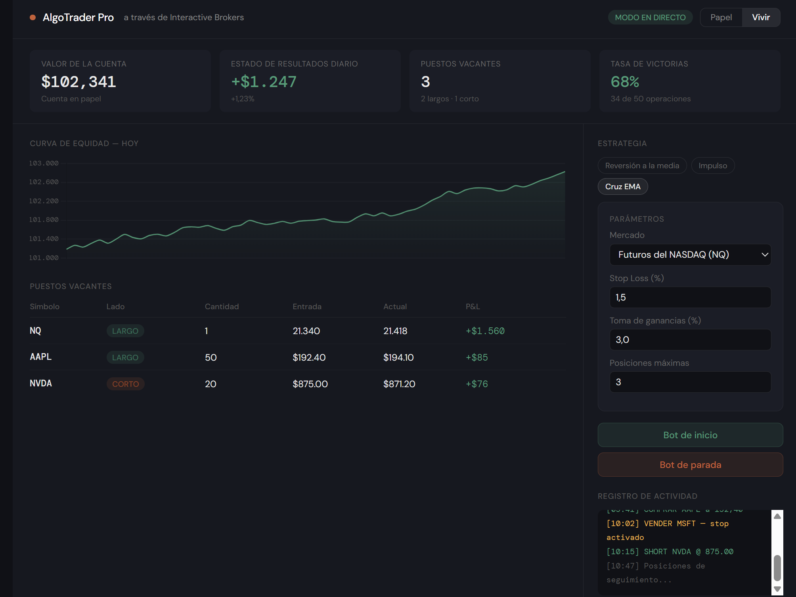

# AlgoTrader Pro — IBKR Automated Trading Bot


> Fully automated trading bot for **Interactive Brokers (IBKR)** with a real-time web dashboard. Trades NASDAQ Futures (NQ) and US equities (AAPL, NVDA, MSFT, GOOGL, AMZN) using three built-in quantitative strategies. Supports optional TradingView webhook integration for external signal ingestion.

---

## 📸 Dashboard Preview



*Real-time WebSocket dashboard — positions, P&L, strategy status, live logs.*

---

## 🏗️ Architecture

```
TradingView Alert (Pine Script)
        │
        ▼
  Webhook Server (Render / ngrok)
        │
        ▼
   bot.py — Strategy Engine
        │
        ├── Mean Reversion
        ├── Momentum
        └── EMA Cross
        │
        ▼
  IBKR TWS / IB Gateway (ib_insync)
        │
        ▼
  Real-time WebSocket Dashboard
```

---

## ✨ Features

| Feature | Detail |
|---|---|
| **3 Strategies** | Mean Reversion, Momentum, EMA Cross |
| **Multi-asset** | NASDAQ Futures (NQ) + US Stocks |
| **Paper & Live modes** | Toggle with a single config flag |
| **Anti-PDT protection** | Prevents pattern day trader rule violations |
| **Global trailing stop** | Portfolio-level drawdown control |
| **Per-position trailing stop** | Individual stop that locks in profits as price moves |
| **Capital allocation logic** | Fixed USD per position, max concurrent positions cap |
| **Real-time dashboard** | WebSocket-powered, dark UI, live P&L and logs |
| **TradingView webhook** | Optional external signal ingestion via HTTP |
| **IBKR native integration** | Uses `ib_insync` — TWS or IB Gateway |

---

## ⚙️ Configuration

All parameters in `BotConfig` at the bottom of `bot.py`:

| Parameter | Default | Description |
|---|---|---|
| `paper_mode` | `True` | Set `False` for live trading |
| `strategy` | `mean_reversion` | `mean_reversion`, `momentum`, `ema_cross` |
| `stop_loss_pct` | `1.5` | Stop loss as % of entry price |
| `take_profit_pct` | `3.0` | Take profit as % of entry price |
| `max_positions` | `3` | Max concurrent open positions |
| `position_size_usd` | `10000` | Dollar value allocated per trade |
| `scan_interval_sec` | `60` | Seconds between market scans |
| `trade_futures` | `True` | Enable NQ futures trading |
| `trade_stocks` | `True` | Enable US stocks trading |

---

## 📐 Strategies

**Mean Reversion** — Buys when price drops >1.5 std below its rolling mean (oversold), sells when >1.5 std above (overbought). Works well in range-bound markets.

**Momentum** — Buys when recent returns accelerate above the longer-term average. Best in trending markets.

**EMA Cross** — Classic golden/death cross using 9 and 21-period EMAs. Simple, reliable, and easy to explain to clients.

---

## 🚀 Quick Start

**Requirements:**
- Python 3.10+
- Interactive Brokers account (paper or live)
- TWS or IB Gateway running locally

```bash
pip install ib_insync pandas numpy
```

1. Open TWS or IB Gateway — enable API connections (port `7497` for paper, `7496` for live)
2. Edit `bot.py` — set your preferred strategy and risk parameters
3. Run:

```bash
python bot.py
```

4. Open your browser at `http://localhost:5000` to view the dashboard.

---

## 🔌 IBKR Port Reference

| Mode | Port |
|---|---|
| TWS Paper Trading | 7497 |
| TWS Live Trading | 7496 |
| IB Gateway Paper | 4002 |
| IB Gateway Live | 4001 |

---

## 📡 TradingView Webhook (Optional)

The bot can receive external signals from TradingView Pine Script strategies via HTTP webhook. Deploy the webhook server to [Render](https://render.com) or expose locally via [ngrok](https://ngrok.com), then point your TradingView alert to the endpoint.

Payload format:
```json
{
  "action": "buy",
  "symbol": "NQ",
  "strategy": "mean_reversion"
}
```

---

## 🛠️ Tech Stack

- **Python 3.10+**
- **ib_insync** — IBKR API wrapper
- **pandas / numpy** — Data processing and signal calculation
- **WebSockets** — Real-time dashboard communication
- **Flask / aiohttp** — Webhook server and dashboard backend

---

## 👤 About the Author

Built by **Cristian Chaves** — Algorithmic Trading & Fintech Developer.

Specializing in automated trading systems, broker API integrations, options analytics, and real-time financial dashboards for retail traders, prop firms, and fintech startups.

🔗 [OptionsGuru — Live Options Analyzer](https://option-guru.vercel.app)  
🔗 [CCL Radar v2 — Argentine ADR/CEDEAR Monitor](https://ccl-radar.vercel.app)  
🔗 [BotSignal Latam — Telegram Signal Channel](https://botsignal.vercel.app)  
📧 Open for freelance projects — [Upwork](https://www.upwork.com/freelancers/cristianchaves) | [Fiverr](https://www.fiverr.com/cristianchaves)
📧 Contacto: quantedgelatam@gmail.com
🌐 GitHub: github.com/cris-devtrading
---

## 📄 License

MIT — free to use, modify, and distribute with attribution.
